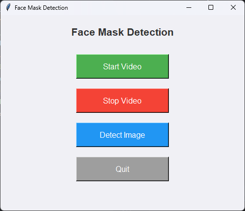
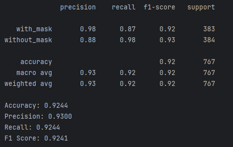
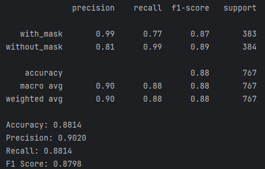
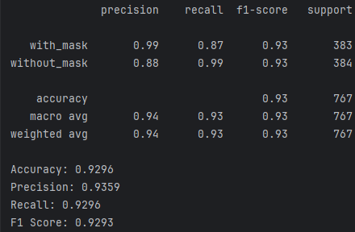
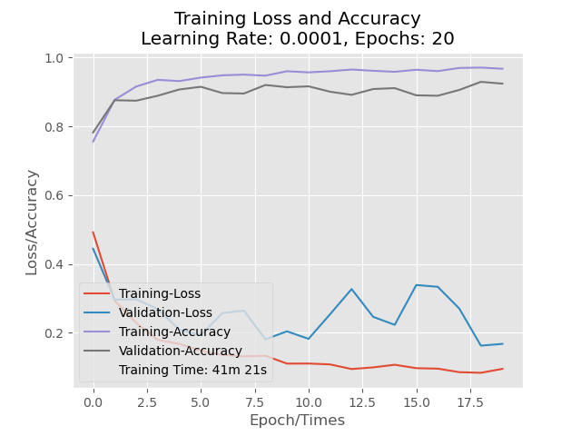
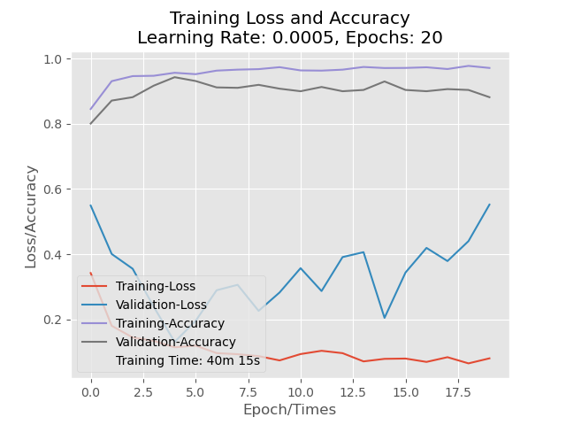
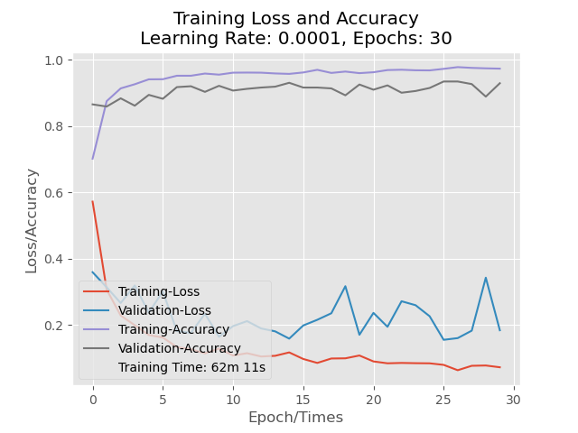

+ Use python 3.7 to build.
+ Load necessary libraries mentioned in requirements.txt.
+ Some requirements may not be mentioned, follow the interpret instruction to install them.
+ When you are all set, run the train_mask_detector.py to train the model.
+ When model is available, run face_mask_detection.py to get in to the GUI.

**** 
## Example GUI

## Evaluation Metrics
### LR=0.0001 EPOCHS=20 DROPOUT=0.5

### LR=0.0005 EPOCHS=20 DROPOUT=0.6

### LR=0.0001 EPOCHS=30 DROPOUT=0.5

## Loss&Accuracy Plot
### LR=0.0001 EPOCHS=20 DROPOUT=0.5

### LR=0.0005 EPOCHS=20 DROPOUT=0.6

### LR=0.0001 EPOCHS=30 DROPOUT=0.5
